<p align="center">
    
</p>

<div align="center">

# 🎨 Bantheon (Bnbong + pantheon)

**A web client for BNGdrasil**

[](https://react.dev)
[](https://www.typescriptlang.org)
[](https://vitejs.dev)
[](https://www.terraform.io)
[](https://nginx.org)

*Part of the [BNGdrasil](https://github.com/BNGdrasil/BNGdrasil) ecosystem - A comprehensive cloud infrastructure project*

</div>

---

## Overview

**Bantheon** is a web client for [BNGdrasil](https://github.com/BNGdrasil/BNGdrasil), including portfolio website and BNGdrasil cloud infrastructure management interface built with React. Named after the temple of the gods from ancient Greek. This client is built with React and TailwindCSS.

### Key Features

- general portfolio website of [bnbong](https://github.com/bnbong)
- OpenStack-based cloud infrastructure management interface (with admin panel)
  - service management
  - real-time monitoring
  - system statistics
  - service CRUD
  - user management
  - VM management

---

## Architecture

// TODO : edit this diagram

```mermaid
graph TD
    A[Bantheon] --> B[React]
    A --> C[TailwindCSS]
    A --> D[React Router]
    A --> E[React Query]
    A --> F[React Context]
    A --> G[Axios]
    A --> H[Heroicons]
    A --> I[React Hook Form]
    A --> J[Zod]
    A --> K[ESLint]
    A --> L[Prettier]
    A --> M[TypeScript]
    A --> N[Vite]
    A --> O[Nginx]
    A --> P[Docker]
    A --> Q[OpenStack]
    A --> R[Prometheus]
    A --> S[Grafana]
    A --> T[Loki]
    A --> U[Nginx]
    A --> V[Docker]
    A --> W[OpenStack]
    A --> X[Prometheus]
    A --> Y[Grafana]
```



---

## Tech Stack

### Frontend

- **React 18**: functional components and hooks-based development
- **TypeScript**: type safety and improved development productivity
- **Vite**: fast development server and build system
- **React Router v6**: SPA routing and navigation
- **TailwindCSS**: utility-first CSS framework

### State Management & HTTP

- **React Query (TanStack Query)**: server state management and caching
- **React Context**: client state management (authentication, etc.)
- **Axios**: HTTP client and interceptor

### UI/UX

- **Headless UI**: accessible styled components
- **Heroicons**: consistent icon system
- **React Hook Form**: performance-optimized form management
- **Zod**: runtime type validation

### Development Tools

- **ESLint**: code quality management
- **Prettier**: code formatting (optional)
- **TypeScript**: static type checking

---

## Quick Start

### Prerequisites

- **Node.js 18+**
- **npm** or **yarn**
- [**Bifrost API Gateway**](https://github.com/BNGdrasil/Bifrost) (http://localhost:8000)
- [**Bidar Auth Server**](https://github.com/BNGdrasil/Bidar) (http://localhost:8001)

### Installation and Execution

```bash
# install dependencies
npm install

# set environment variables
cp .env.example .env
# check/modify API server URL in .env file

# start development server
npm run dev

# access http://localhost:3000 in browser
```

### Build and Deploy

```bash
# production build
npm run build

# built files are created in dist/ directory

# run with Docker (optional)
docker build -t bantheon .
docker run -p 3000:3000 bantheon
```

---

## Project Structure

// TODO : edit this structure

```
src/
├── 
```

---

## Main Configuration

### Environment Variables (.env)
```bash
# API server settings
VITE_AUTH_API_URL=http://localhost:8001      # Bidar auth server
VITE_GATEWAY_API_URL=http://localhost:8000   # Bifrost API gateway

# feature flags
VITE_ENABLE_ADMIN=true                       # enable admin feature
VITE_ENABLE_GAMES=true                       # enable games feature
VITE_ENABLE_PORTFOLIO=true                   # enable portfolio feature
```

### API proxy settings (vite.config.ts)

For CORS issues in development environment, this includes proxy settings to resolve them.

```typescript
server: {
  proxy: {
    '/api': 'http://localhost:8000',    # Bifrost proxy
    '/auth': 'http://localhost:8001',   # Bidar proxy
  },
}
```

---

## Authentication Flow

1. **Login**: user inputs credentials in login form
2. **Token Issuance**: Bidar server issues JWT access/refresh tokens
3. **Token Storage**: tokens are stored in local storage
4. **Automatic Authentication**: Axios interceptor automatically attaches tokens to all requests
5. **Token Refresh**: automatically refreshed with refresh token when expired
6. **Logout**: invalidates tokens and clears local storage

## Design System

### Color Palette

- **Primary**: Blue (blue-600)
- **Secondary**: Gray (gray-500~900)
- **Success**: Green (green-500~600)
- **Warning**: Yellow (yellow-500~600)  
- **Error**: Red (red-500~600)

### Component Classes

- **Buttons**: `.btn-primary`, `.btn-secondary`, `.btn-outline`, `.btn-ghost`
- **Inputs**: `.input`
- **Cards**: `.card`, `.card-header`, `.card-content`, `.card-footer`

### Responsive Breakpoints

- **sm**: 640px+
- **md**: 768px+
- **lg**: 1024px+
- **xl**: 1280px+

---

## BNGdrasil Ecosystem

Bifrost is part of the larger **[BNGdrasil](https://github.com/BNGdrasil)** cloud infrastructure project:

- **🎨 [Bantheon](https://github.com/BNGdrasil/Bantheon)** - Web Frontend & Portfolio (this project)
- **🌉 [Bifrost](https://github.com/BNGdrasil/Bifrost)** - API Gateway
- **🔐 [Bidar](https://github.com/BNGdrasil/Bidar)** - Authentication & Authorization Server
- **🏗️ [Baedalus](https://github.com/BNGdrasil/Baedalus)** - Infrastructure as Code (Terraform)
- **🌐 [Bsgard](https://github.com/BNGdrasil/Bsgard)** - Custom VPC & Networking
- **🎮 [Blysium](https://github.com/BNGdrasil/Blysium)** - Gaming Platform

Each component is designed to work independently while integrating seamlessly with others.

---

## License

This project is used for personal learning and development purposes.
