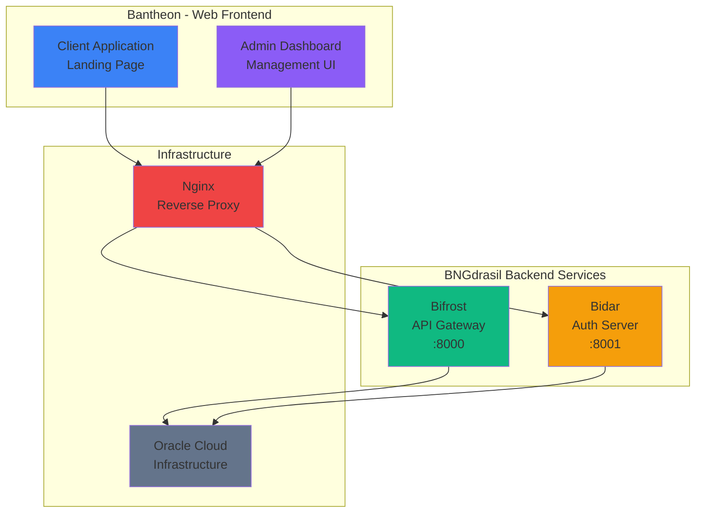

<p align="center">
    
</p>

<div align="center">

# 🎨 Bantheon (Bnbong + pantheon)

**A web client for BNGdrasil**

[](https://react.dev)
[](https://www.typescriptlang.org)
[](https://vitejs.dev)
[](https://www.terraform.io)
[](https://nginx.org)

*Part of the [BNGdrasil](https://github.com/BNGdrasil/BNGdrasil) ecosystem - A comprehensive cloud infrastructure project*

</div>

---

## Overview

**Bantheon** is a web client for [BNGdrasil](https://github.com/BNGdrasil/BNGdrasil), including portfolio website and BNGdrasil cloud infrastructure management interface built with React. Named after the temple of the gods from ancient Greek. This client is built with React and TailwindCSS.

### Key Features

- general portfolio website of [bnbong](https://github.com/bnbong)
- OpenStack-based cloud infrastructure management interface (with admin panel)
  - service management
  - real-time monitoring
  - system statistics
  - service CRUD
  - user management
  - VM management

---

## Architecture


```mermaid
graph TB
    subgraph "Bantheon - Web Frontend"
        CLIENT[Client Application<br/>Landing Page]
        ADMIN[Admin Dashboard<br/>Management UI]
    end
    
    subgraph "BNGdrasil Backend Services"
        BIFROST[Bifrost<br/>API Gateway<br/>:8000]
        BIDAR[Bidar<br/>Auth Server<br/>:8001]
    end
    
    subgraph "Infrastructure"
        NGINX[Nginx<br/>Reverse Proxy]
        OCI[Oracle Cloud<br/>Infrastructure]
    end
    
    CLIENT --> NGINX
    ADMIN --> NGINX
    NGINX --> BIFROST
    NGINX --> BIDAR
    BIFROST --> OCI
    BIDAR --> OCI
    
    style CLIENT fill:#3b82f6
    style ADMIN fill:#8b5cf6
    style BIFROST fill:#10b981
    style BIDAR fill:#f59e0b
    style NGINX fill:#ef4444
    style OCI fill:#64748b
```

---

## Tech Stack

### Frontend

- **React 18**: functional components and hooks-based development
- **TypeScript**: type safety and improved development productivity
- **Vite**: fast development server and build system
- **React Router v6**: SPA routing and navigation
- **TailwindCSS**: utility-first CSS framework

### State Management & HTTP

- **React Query (TanStack Query)**: server state management and caching
- **React Context**: client state management (authentication, etc.)
- **Axios**: HTTP client and interceptor

### UI/UX

- **Headless UI**: accessible styled components
- **Heroicons**: consistent icon system
- **React Hook Form**: performance-optimized form management
- **Zod**: runtime type validation

### Development Tools

- **ESLint**: code quality management
- **Prettier**: code formatting (optional)
- **TypeScript**: static type checking

---

## Quick Start

### Prerequisites

- **Node.js 18+**
- **npm** or **yarn**
- [**Bifrost API Gateway**](https://github.com/BNGdrasil/Bifrost) (http://localhost:8000)
- [**Bidar Auth Server**](https://github.com/BNGdrasil/Bidar) (http://localhost:8001)

### Client Application (Landing Page)

```bash
# navigate to client directory
cd client

# install dependencies
npm install

# start development server
npm run dev

# access http://localhost:3000 in browser
```

### Admin Dashboard

```bash
# navigate to admin directory
cd admin

# install dependencies
npm install

# start development server
npm run dev

# access http://localhost:5174 in browser
```

### Build and Deploy

```bash
# build client application
cd client
npm run build

# build admin dashboard
cd ../admin
npm run build

# built files are created in each dist/ directory
# deliver dists to VM1 manually
```

---

## Project Structure

```
bantheon/
├── client/                       # Main client application (landing page)
│   ├── src/
│   │   ├── App.tsx              # Main application component (landing page)
│   │   ├── main.tsx             # Application entry point
│   │   ├── index.css            # Global styles
│   │   ├── assets/              # Static assets
│   │   ├── types/               # TypeScript type definitions
│   │   │   └── index.ts
│   │   └── vite-env.d.ts        # Vite environment types
│   ├── dist/                    # Production build output
│   ├── package.json
│   ├── vite.config.ts          # Vite configuration
│   ├── tsconfig.json           # TypeScript configuration
│   └── index.html              # HTML entry point
│
├── admin/                       # Admin dashboard application
│   ├── src/
│   │   ├── App.tsx             # Admin app component
│   │   ├── main.tsx            # Entry point
│   │   ├── index.css           # Global styles
│   │   ├── components/
│   │   │   └── Layout.tsx      # Admin layout with sidebar
│   │   ├── pages/
│   │   │   ├── LoginPage.tsx
│   │   │   ├── DashboardPage.tsx
│   │   │   ├── UsersPage.tsx
│   │   │   ├── ServicesPage.tsx
│   │   │   ├── LogsPage.tsx
│   │   │   └── SettingsPage.tsx
│   │   ├── contexts/
│   │   │   └── AuthContext.tsx
│   │   └── services/
│   │       └── api.ts
│   ├── dist/                   # Production build output
│   ├── package.json
│   ├── vite.config.ts
│   ├── tsconfig.json
│   ├── env.example             # Environment variables example
│   └── env.production          # Production environment variables
│
├── nginx/                      # Nginx reverse proxy configuration
│   ├── nginx.conf
│   └── DEPLOYMENT_GUIDE.md
│
├── docker-compose.yml          # Docker Compose configuration
└── README.md                   # This file
```

---

## Main Configuration

### Client Application

The client application is a simple landing page with no external dependencies or configuration required. It runs on port 3000 by default.

### Admin Dashboard Environment Variables

Create a `.env` file in the `admin/` directory based on `env.example`:

```bash
# API Base URL
VITE_API_BASE_URL=https://api.bnbong.com

# Admin API Base URL
VITE_ADMIN_API_BASE_URL=https://api.bnbong.com/admin/api
```

---

## Authentication Flow

### Admin Dashboard

1. **Login**: Admin user authenticates via Bidar
2. **JWT Token**: Access token stored in localStorage
3. **Authorization**: All admin API requests include Bearer token
4. **Auto Logout**: 401 errors trigger automatic logout
5. **Permission Check**: 403 errors show permission denied message

### Client Application

The client application is a public landing page and does not require authentication.

---

## BNGdrasil Ecosystem

Bantheon is part of the larger **[BNGdrasil](https://github.com/BNGdrasil)** cloud infrastructure project:

- **🎨 [Bantheon](https://github.com/BNGdrasil/Bantheon)** - Web Frontend & Portfolio (this project)
- **🌉 [Bifrost](https://github.com/BNGdrasil/Bifrost)** - API Gateway
- **🔐 [Bidar](https://github.com/BNGdrasil/Bidar)** - Authentication & Authorization Server
- **🏗️ [Baedalus](https://github.com/BNGdrasil/Baedalus)** - Infrastructure as Code (Terraform)
- **🌐 [Bsgard](https://github.com/BNGdrasil/Bsgard)** - Custom VPC & Networking

Each component is designed to work independently while integrating seamlessly with others.

---

## License

This project is used for personal learning and development purposes.
